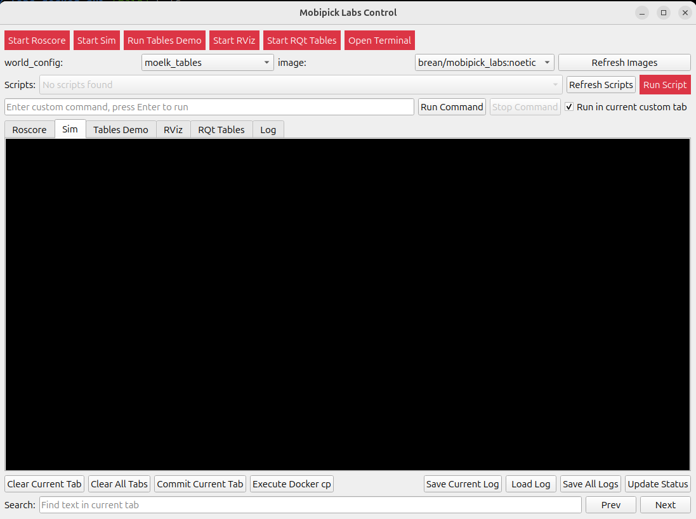

# Mobipick Labs Docker GUI

The Mobipick Labs Docker GUI is a PyQt5 desktop application that controls the
Docker-based Mobipick Labs ROS 1 simulation. It wraps Docker Compose commands,
sets the environment required by the selected Docker image and ROS workspace,
streams process output into GUI tabs, and performs cleanup when the application
closes.

Related project and distribution links:

- Mobipick Labs repository: <https://github.com/DFKI-NI/mobipick_labs>
- PyPI package: <https://pypi.org/project/mobipick-labs-docker-gui/>

This README is developer documentation for maintaining and extending the
application. User-facing button and menu documentation lives in the
[`gui_user_documentation.md`](mobipick_gui/resources/gui_user_documentation.md)
resource and is rendered in the application from **Help > Documentation**.



## Repository layout

```text
.
|-- gui.py                         # Legacy shim that forwards to mobipick_gui.cli
|-- mobipick_gui/
|   |-- cli.py                     # QApplication setup and CLI parsing
|   |-- main_window.py             # Main PyQt window and Docker/ROS orchestration
|   |-- process_tab.py             # QProcess plus log widget wrapper
|   |-- log_widget.py              # Buffered QTextEdit for high-volume logs
|   |-- documentation_dialog.py    # Rendered user documentation and search
|   |-- bug_report.py              # Diagnostic report builder
|   |-- setup_wizard.py            # Image setup and custom image choices
|   |-- workspace_dialog.py        # Workspace manager dialog
|   |-- workspaces.py              # Workspace registry and runtime env model
|   |-- settings_transfer.py       # Portable import/export of GUI settings
|   |-- window_layout.py           # wmctrl/xprop capture and replay helper
|   |-- config.py                  # Bundled/user config loading and defaults
|   `-- resources/
|       |-- docker-compose.yml
|       |-- custom_entrypoint.sh
|       |-- clean.bash
|       |-- gui_user_documentation.md
|       |-- config/
|       |   |-- gui_settings.yaml
|       |   |-- button_commands_labs.yaml
|       |   |-- worlds.yaml
|       |   `-- docker_cp_image_tag.yaml
|       `-- scripts/
|           |-- enter_host_shell.py
|           |-- terminal.bashrc
|           `-- ros_workspace_setup.bash
|-- tests/mobipick_gui/            # pytest regression tests
|-- pyproject.toml                 # Packaging metadata and package data
|-- MANIFEST.in                    # Source distribution manifest
`-- doc/                           # Project imagery
```

Private experiments and templates under `mobipick_gui/resources/private/` are
excluded from package data and source distribution output.

## Runtime architecture

`mobipick_gui.cli.main()` creates a `QApplication`, instantiates
`MainWindow`, and forwards unknown arguments to Qt. `MainWindow` owns the GUI
state, menu actions, process tabs, workspace/image selection, recording state,
and shutdown sequence.

Runtime commands are executed in two ways:

- Long-running tasks use `QProcess` through `ProcessTab`. Output is merged,
  sanitized for terminal escape sequences, converted from ANSI color to HTML
  when needed, and flushed into `LogTextEdit`.
- Short helper commands use `subprocess.run()` through `MainWindow._sp_run()`,
  which injects the same runtime environment and logs the command to the GUI.

Docker Compose is always invoked by the GUI with the bundled compose file and a
fixed project name. The compose file is not intended to be run directly during
normal GUI use, because the GUI also tracks process state, xhost access, tabs,
recording, and cleanup.

## Prerequisites

The application targets Linux desktops with X11.

- Python 3.8 or newer.
- PyQt5 5.15 or newer.
- Docker Engine and the Docker Compose plugin available to the current user.
- An X11 desktop session for Gazebo, RViz, RQt, and recording.
- Optional but recommended: NVIDIA Container Toolkit for GPU-accelerated
  simulation.
- Optional tools for specific features:
  - `wmctrl` and `xprop` for window layout capture/replay.
  - `graphviz` for workspace graph rendering.
  - `ffmpeg` for Auto Launch screen recording.

Common Ubuntu setup:

```bash
sudo apt update
sudo apt install docker.io docker-compose-plugin wmctrl x11-utils graphviz ffmpeg
sudo systemctl enable docker
sudo systemctl start docker
sudo usermod -aG docker "$USER"
```

Log out and back in after changing Docker group membership, or start a shell
with `newgrp docker`.

Use the setup wizard on first launch to pull at least one Mobipick image on
the host PC with streamed output. If you choose the manual wizard option, run
one of these commands and confirm in the wizard when it finishes:

```bash
docker pull ozkrelo/x_mobipick_labs:noetic-v1.1
docker pull ozkrelo/x_mobipick_labs:noetic-v1.2
```

## Installation

Install the released package from PyPI:

```bash
python -m pip install mobipick-labs-docker-gui
```

If you installed an older released version, upgrade it in the same Python
environment:

```bash
python -m pip install --upgrade mobipick-labs-docker-gui
python -m pip show mobipick-labs-docker-gui
```

If the command was installed with `--user` and your shell cannot find
`mobipick-labs-docker-gui`, make sure Python's user script directory is on
`PATH`, for example `~/.local/bin` on many Linux systems.

## Development setup

Create an editable install from the checkout:

```bash
python -m pip install -e .
```

Install test-only tools when working on regression tests:

```bash
python -m pip install pytest pytest-qt
```

Launch the GUI from the checkout:

```bash
mobipick-labs-docker-gui --verbose 2
```

Equivalent debug entry points:

```bash
python -m mobipick_gui --verbose 2
python gui.py --verbose 2
```

The verbosity option accepts levels 1 through 3. Unknown CLI arguments are
passed to Qt, for example `-platform offscreen` in headless checks.

## Tests

Run the full test suite:

```bash
pytest
```

Most GUI tests set `QT_QPA_PLATFORM=offscreen` and stub Docker discovery or
process methods. Keep new tests Docker-independent unless the test explicitly
targets Docker command construction.

Current coverage includes:

- configuration loading and writable user config paths;
- workspace registry, switching, import/export, and image/workspace matching;
- setup wizard and custom image profile persistence;
- remote ROS master behavior;
- Auto Launch and recording state transitions;
- menu-only status/image controls and menu tooltips;
- bug report formatting;
- documentation dialog rendering and keyword search.

## Packaging

The package version is declared in `pyproject.toml`. The fallback version used
when running directly from an unpackaged source tree lives in
`mobipick_gui/version.py`; keep both values in sync for releases.

Build source and wheel artifacts with:

```bash
python -m pip install --upgrade build
python -m build
```

Optionally validate the artifacts before uploading:

```bash
python -m pip install --upgrade twine
python -m twine check dist/*
```

Package data is declared in both `pyproject.toml` and `MANIFEST.in`. When adding
new runtime assets under `mobipick_gui/resources/`, update both files so editable
installs, wheels, and source distributions all behave the same.

The console script installed by the package is:

```text
mobipick-labs-docker-gui = mobipick_gui.cli:main
```

### PyPI release flow

Publishing is handled by `.github/workflows/python-publish.yml`. The workflow
builds the distributions and uploads them to PyPI when a GitHub Release is
published. Merging to `main` alone does not publish a new PyPI version.

Recommended release steps:

1. Update the version in `pyproject.toml` and `mobipick_gui/version.py`.
2. Run the tests and build locally.
3. Merge the release branch to `main`.
4. Create and publish a GitHub Release from `main`, using a tag such as
   `v0.1.1`.
5. Confirm the workflow succeeds, then verify the new release on
   <https://pypi.org/project/mobipick-labs-docker-gui/>.

## Configuration model

Bundled defaults live under `mobipick_gui/resources/config/`.
`mobipick_gui.config.CONFIG_DEFAULTS` supplies hard defaults, then
`config/gui_settings.yaml` is merged over them, then the per-user
`gui_settings.yaml` is merged last.

Important environment overrides:

- `MOBIPICK_GUI_DATA_ROOT` points the package at an alternate resources root.
- `MOBIPICK_GUI_CONFIG` points to an alternate per-user GUI settings file.
- `MOBIPICK_WORKSPACE_CONFIG` points to an alternate workspace registry.
- `XDG_CONFIG_HOME` and `XDG_DATA_HOME` control the default per-user roots.

Default per-user state locations:

```text
~/.config/mobipick-labs-docker-gui/gui_settings.yaml
~/.config/mobipick-labs-docker-gui/workspaces.yaml
~/.config/mobipick-labs-docker-gui/window_layouts/{workspace}.yaml
~/.config/mobipick-labs-docker-gui/docker_cp_image_tag.yaml
~/.config/mobipick-labs-docker-gui/docker_cp_profiles/{workspace}_docker_cp_image_tag.yaml
~/.config/mobipick-labs-docker-gui/launch_sequences/
~/.config/mobipick-labs-docker-gui/profiles/
~/.local/share/mobipick-labs-docker-gui/recordings/
~/.local/share/mobipick-labs-docker-gui/image_builds/
```

Keep bundled resource files immutable at runtime. User edits should be written
to per-user config/data paths.

The top-level **Settings** menu exposes migration and troubleshooting actions:
**Export All Settings...** writes the workspace registry, per-user GUI settings,
and workspace profiles to one portable YAML file; **Import All Settings...**
restores that file under a chosen workspace master folder; **Show Configuration
Paths** displays the writable config/data paths that the GUI manages; **Copy
Full Reset Command...** shows a destructive warning and copies an opt-in
terminal command for deleting all per-user GUI config/data roots from the PC.
The reset command requires typing `DELETE_MOBIPICK_GUI_CONFIG` in the terminal
before it runs `rm -rf`; it does not remove Docker images, Docker containers,
ROS workspaces, the source checkout, or bundled package defaults.

## Docker and ROS services

The bundled compose file defines three services:

- `mobipick` runs the simulator.
- `mobipick_cmd` runs local ROS tools, scripts, terminals, and custom commands.
- `mobipick_remote_cmd` runs tools with host networking for external ROS
  master mode.

The GUI injects these important values into Docker commands:

- `MOBIPICK_IMAGE` selected from the image combo box.
- `MOBIPICK_WORLD` selected from `worlds.yaml`.
- `MOBIPICK_CONTAINER_USER`, `MOBIPICK_CONTAINER_ENTRYPOINT`, and
  `MOBIPICK_CONTAINER_WORKDIR` derived from image profiles.
- `MOBIPICK_UID`, `MOBIPICK_GID`, `MOBIPICK_HOST_USER`,
  `MOBIPICK_HOST_GROUP`, and `MOBIPICK_HOST_HOME` derived from the host user.
- Workspace mount and ROS environment values from `WorkspaceRegistry`.
- `ROS_MASTER_URI` from local Roscore or remote ROS master mode.

The GUI creates or reuses the external Docker network named `mobipick` and
labels one-off containers with `mobipick.exec` and `mobipick.tab` so they can be
found and stopped reliably.

## Workspace model

`WorkspaceRegistry` stores host catkin workspaces, their inheritance, optional
workspace-specific Docker images, button profiles, auto-launch profiles, and
simulator command overrides.

For host workspace mode, the registry mounts the common workspace root once
inside Docker at the canonical container root `~/ros_ws`. It maps selected
workspaces and underlays into that root, exports `MOBIPICK_WORKSPACE_*`
variables, and provides fallback source paths when a workspace is not built.

`WorkspaceManagerDialog` is the UI for:

- choosing or creating a master folder;
- discovering child workspaces with `src/`;
- adding or creating standalone workspaces;
- editing inheritance and image/button/launch profiles;
- building the active workspace inside Docker;
- exporting/importing portable GUI settings;
- rendering the workspace graph.

Builds use `catkin build` inside the selected development image. Public root
images are configured as image-default only and do not mount host workspaces.

## Image profiles and setup wizard

Image behavior is controlled by `images` in `gui_settings.yaml`.

- `default` is the preferred Docker image.
- `discovery_filters` controls which local images appear in the combo box.
  The **Configure Image Filters** dialog shows these filters next to the
  blacklist and previews which local Docker images will be used, ignored, or
  hidden.
- `blacklist` contains image refs or glob patterns ignored after discovery
  filtering.
- `profiles` maps image refs or glob patterns to container user behavior,
  workspace support, compatible workspaces, working directory, entrypoint, and
  tooltip description.

The setup wizard first checks common Ubuntu host dependencies and shows one
checkbox per package so users can copy a selected `apt` command into a
terminal, install the tools themselves, and mark the step done. It can then
pull public images on the host PC with streamed output, pause for a manual pull
confirmation, choose a default image, build a host-user development image, and
clone/build `DFKI-NI/mobipick_labs` from source in a host-mounted workspace.
Each optional wizard page has a skip button.
It does not enable `docker cp` paths by default; configure any copy rules later
from **Tools > Docker > Configure Docker cp Paths**.
The custom image builder writes a Docker build context under the per-user data
directory, copies `custom_entrypoint.sh`, adds a host-matching user, installs
passwordless sudo, and tags the result according to the wizard fields.

The source install step creates
`<master folder>/clean_mobipick_labs_ws/src/mobipick_labs` by default, runs the
work inside Docker with the workspace mounted to the host, sources
`/opt/ros/noetic/setup.bash`, then executes `./install-deps.sh` and `./build.sh`.
Output streams into an **Install Source** tab. Existing git checkouts are
updated; existing non-git paths stop the step with an explicit error.

## Button profiles

Default toolbar buttons are loaded from
`resources/config/button_commands_labs.yaml`. `load_button_layout()` supports
workspace-specific replacements through the workspace registry.
Use **Tools > Configure Toolbar Buttons** to edit the active profile from the
GUI. Workspace edits are saved as writable per-user copies named for the active
workspace, and that workspace is updated to point at its copy. Packaged global
profiles are also copied before saving. The dialog shows the editable button
key, label, command, compose service, and tooltip; other execution fields are
preserved when saving.

Use **Load Profile** and **Export Profile** in that dialog to move complete
button configurations as one YAML file. The automatic save location is the
per-user XDG config directory so an installed package is never modified at
runtime; exporting is the way to place a profile in a private repository or
share it with another setup.

Button entries can be:

- `kind: builtin` with actions such as `sim`, `tables_demo`, `rviz`, and
  `rqt_tables`;
- `kind: command` with an arbitrary command executed either in Docker or on the
  host.

Every editable top-row button has a `command`. Default commands for the bundled
`sim`, `tables`, `rviz`, and `rqt` buttons live in the button profile and are
used by their builtin start/stop wrappers. Legacy workspace `sim_command`
values remain supported and are written into the button profile when saved from
the GUI editor.

Command entries can declare:

- `requires_roscore`;
- `reuse_tab`;
- `world_config_required` and `world_arg_name`;
- `setup` or `pre_command`;
- `host`;
- `stop_command`;
- `log_command`;
- `pass_ros_master_uri`;
- `service`, for choosing the compose service used by Docker command buttons.
  Leave it empty for the normal tool service, or use `mobipick` for launch
  files that start Gazebo themselves and need the simulator service identity.

The GUI normalizes all entries and creates matching process tabs and
start/stop visual state.

`roscore` and `terminal` are fixed top-row buttons and are not stored in button
profiles. `sim` and `rviz` are required profile buttons: they cannot be
removed, but their `command` fields can override the default simulation and
RViz launch commands. Other profile buttons can be added, removed, reordered,
or changed.

## Auto Launch

`load_launch_sequence_plan()` resolves Auto Launch YAML from a workspace
profile, per-user launch sequence directory, or fallback filenames derived from
the active button profile.

The saved format stores:

- `timeline`: button key plus `at_seconds`;
- `shutdown.order`: reverse or custom stop order;
- optional `shutdown.skip`;
- optional button text/tooltip metadata;
- `recording.start_delay_seconds`.

`AutoLaunchWizard` edits the timeline and saves it to a writable per-user path
when the source is a packaged resource. Auto Launch can also coordinate window
layout replay and delayed recording startup.

## Recording and window layout

Recording captures X11 screen video with `ffmpeg -f x11grab`. It is armed by the
GUI checkbox and starts only after Auto Launch begins and the timeline/layout
delay has elapsed. Recording sessions create timestamped folders containing the
MP4, `ffmpeg.log`, and saved HTML logs when requested.

Window layout capture uses `WindowLayoutManager` plus `wmctrl` and `xprop`.
The manager records the baseline windows present when the GUI starts, excludes
the GUI/helper windows during capture, stores a separate layout for each active
workspace, and applies saved positions to matching new windows after the
configured delay. The `window_layout.state_file` setting may include
`{workspace}` or `{workspace_slug}`; paths without a placeholder are treated as
a base location and expanded into one YAML file per workspace.

## Remote ROS master mode

Remote mode is controlled by the hidden Remote ROS Master view controls. When
enabled:

- local Roscore and simulation actions are disabled;
- tools, scripts, terminals, configured commands, and custom commands use
  `mobipick_remote_cmd`;
- `ROS_MASTER_URI` is normalized and passed into containers;
- host networking is used so ROS 1 callbacks can reach the nodes.

Changing remote mode or the URI is blocked while workspace processes are
running.

## Docker cp profiles

`docker_cp_image_tag.yaml` defines optional copy rules keyed by `default` or
by ROS workspace name.

- `host_to_container` entries run automatically after eligible containers
  appear.
- `container_to_host` entries run from **Tools > Docker > Execute Docker cp**
  for the current running tab.

When the Docker image default workspace is active, user edits are saved to
`~/.config/mobipick-labs-docker-gui/docker_cp_image_tag.yaml`. When a ROS
workspace is active, edits are saved to
`~/.config/mobipick-labs-docker-gui/docker_cp_profiles/{workspace}_docker_cp_image_tag.yaml`.
No copy rules are enabled in the bundled defaults, so fresh installs do not copy
`pick_n_place.rviz` or any other host file unless the user adds rows here.
The editor shows workspaces rather than Docker image tags. Add Row opens a
path setup dialog; the host side uses a local file picker, and the container
side can use a selected running setup container or manual path entry. Empty
profiles in the active writable file override bundled entries.

## Logging and reports

Every process tab uses `LogTextEdit`, which buffers updates to keep high-volume
process output responsive. The log widget keeps only the configured maximum
block count.

GUI-originated messages and executed commands are written to the **Log** tab.
Users can save the current tab, save all tabs, or load a saved HTML log into a
closable tab. The bottom search row searches only the current log tab.

The bug report dialog collects selected diagnostic sections, including GUI
version, selected workspace, selected image/workspace match, optional command
outputs, workspace graph, log tab text, and user notes. Keep new diagnostics
optional so report generation remains useful on machines without every tool
installed.

## User documentation dialog

The Help documentation window renders
`resources/gui_user_documentation.md` with `QTextBrowser`. It supports keyword
search from a line edit plus Find and Previous buttons. Matching keywords are
highlighted and the current match is selected and scrolled into view.

When editing user documentation, keep the text task-oriented and avoid
developer internals. Developer details belong in this README or code comments.

## Shutdown behavior

Closing the GUI starts a controlled shutdown:

1. cancel Auto Launch timers and pending recording start;
2. stop screen recording if active;
3. stop the external terminal container;
4. kill GUI-owned background `QProcess` instances;
5. stop simulator and related Mobipick containers;
6. run `clean.bash` when available;
7. revoke temporary X11 access;
8. quit the Qt application.

Avoid adding early returns in shutdown paths unless they still leave the GUI in
a recoverable state.

## Development guidelines

- Keep user-visible defaults in `resources/config/` and hard fallbacks in
  `config.py`.
- Keep per-user writes out of packaged resources.
- Prefer extending existing helper methods in `MainWindow` before adding a new
  orchestration path.
- Add tests under `tests/mobipick_gui/` for new behavior.
- Stub Docker and external tools in tests unless the test only validates command
  construction.
- For new package resources, update `pyproject.toml` and `MANIFEST.in`.
- For new user-visible controls, update
  `resources/gui_user_documentation.md`.
- For new developer-facing configuration, update this README.

## Troubleshooting for developers

- If no images appear, open **Configure Image Filters** to inspect
  `images.discovery_filters`, `images.blacklist`, and the preview of local
  images from `docker images`.
- If GUI tests create real dialogs unexpectedly, set
  `QT_QPA_PLATFORM=offscreen` and monkeypatch Docker discovery.
- If a workspace does not mount, check the selected image profile for
  `supports_host_workspaces`.
- If RViz or Gazebo windows do not open, verify X11, `DISPLAY`, Docker
  permissions, and temporary `xhost` access.
- If recordings produce no MP4, inspect the session `ffmpeg.log` and the
  configured display/resolution.
- If window layout replay does nothing, install `wmctrl` and `xprop` and save a
  layout after simulator windows are visible.
