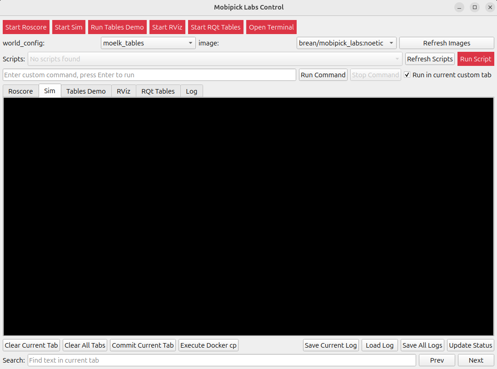

# Mobipick Labs Docker GUI

The Mobipick Labs Docker GUI is a PyQt5 desktop application that orchestrates the
Docker-based Mobipick Labs robotics simulation. Instead of manually invoking
`docker compose` yourself, you launch `python gui.py` and drive the bring-up,
monitoring, and shutdown of the simulation through an interactive interface.
The GUI reads the bundled configuration files, runs Docker commands on your
behalf, and streams live logs so you can follow what is happening in each
container.



## Repository layout

```
├── gui.py                  # CLI entry point that launches the Qt event loop
├── docker-compose.yml      # Compose file used internally by the GUI
├── config/                 # YAML configuration consumed at runtime
├── mobipick_gui/           # PyQt5 widgets, process orchestration, and helpers
└── clean.bash              # Convenience script invoked when shutting down
```

The compose file is **not** intended to be executed directly. The GUI manages it
for you by spawning `docker compose` subprocesses, supervising their lifecycle,
and performing cleanup logic when you close the application.

## Prerequisites

* Python 3.8+ with PyQt5 available (e.g. `pip install PyQt5`).
* Docker Engine and the Docker Compose plugin accessible to your user.
* Access to the Mobipick Labs image repository (for example
  `brean/mobipick_labs:noetic`).
* An X11 server that allows the containers to create GUI windows. The GUI
  issues the required `xhost` commands automatically when needed.

## Launching the GUI

1. Clone the repository.
2. Install Python dependencies if PyQt5 is not already present.
3. Start the application:
   ```bash
   python gui.py
   ```
4. When the window opens, use the top row of buttons to bring up ROS core,
   start or stop the simulator, toggle RViz/RQt, or open a Docker-backed
   terminal. The GUI ensures the correct container sequence is followed.

You can interrupt the GUI with <kbd>Ctrl</kbd>+<kbd>C</kbd> in the launch
terminal; the application traps the signal, stops the running containers, and
then exits gracefully.

### Command-line options

`gui.py` accepts a single verbosity switch that controls how much diagnostic
information the GUI prints to its log tabs and the launch terminal:

```bash
python gui.py --verbose        # Same as -v or --v
python gui.py -v 3             # Maximum verbosity
python gui.py -v 1             # Quietest mode (default)
```

You can also pass through any Qt-specific arguments (for example `-platform`)
after the GUI options; they are forwarded automatically to `QApplication`.

## Understanding the GUI workflow

* **Process supervision:** Each button spawns a `QProcess` that executes a
  Docker command (`docker compose up`, `docker compose exec`, `docker cp`, etc.).
  Environment variables from `config/gui_settings.yaml` ensure the commands run
  with consistent settings (for example `COMPOSE_IGNORE_ORPHANS=1`).
* **State polling:** Timers defined in `config/gui_settings.yaml` periodically
  inspect Docker to reflect whether the ROS core, simulator, RViz, or RQt
  containers are alive before updating the button states.
* **Log streaming:** Every subprocess pipes its stdout/stderr into a dedicated
  tab, colourised via `mobipick_gui/ansi.py` so you can tail the container logs
  without leaving the GUI.
* **Graceful shutdown:** When you exit, the GUI stops active containers in a
  safe order, runs `clean.bash` to remove temporary resources, and only then
  closes the window.

## Configuring the GUI

All customisation lives in the `config/` directory. You can copy these files and
adapt them to your workflow:

* **`config/gui_settings.yaml`** – Controls UI behaviour such as window geometry
  and log styling, defines timer intervals, button colours, terminal launcher
  settings, and Docker environment variables. Most keys mirror the defaults
  declared in `mobipick_gui/config.py` so you can override just the values you
  need.
* **`config/worlds.yaml`** – Lists the world configurations that populate the
  drop-down selector when launching the simulator. Edit or append entries to
  expose additional Gazebo worlds shipped in your Mobipick Labs Docker image.
* **`config/docker_cp_image_tag.yaml`** – Declares optional `docker cp`
  synchronisation rules keyed by image name. Host-to-container copies run
  automatically after the container starts, while container-to-host copies are
  triggered by the "Execute Docker cp" button inside the GUI.

## Working with the compose file

Although `docker-compose.yml` lives in the repository, the GUI is responsible for
translating user actions into compose commands. Typical sequences are:

1. **ROS core toggle:** `docker compose up roscore` starts the lightweight
   orchestration container. The GUI remembers the container name and watches for
   it to become healthy before enabling the simulator button.
2. **Simulator toggle:** `docker compose up mobipick-run` launches the main
   Gazebo environment. When you stop it, the GUI optionally synchronises files
   defined in `docker_cp_image_tag.yaml` and then calls `docker compose stop`
   with a configurable timeout.
3. **Visualization tools:** RViz and RQt are launched with `docker compose run`
   so each tool receives its own tabbed log stream.

Because the GUI tracks container state, you should avoid running the compose
file manually in parallel—it can confuse the state machine and lead to orphaned
containers. If you need a manual clean slate, run `./clean.bash` with the GUI
closed to remove stopped containers and networks.

## Tips and troubleshooting

* Verify that Docker commands succeed from your shell before launching the GUI;
  it executes the same binaries with your current user.
* If the GUI cannot discover your Mobipick Labs image, adjust the
  `images.discovery_filters` list in `config/gui_settings.yaml`.
* When experimenting with new Gazebo worlds or launch files, consider adding a
  custom button tab via `mobipick_gui/process_tab.py` so you can track logs in
  the same window.
* Logs are retained up to `log.max_block_count` lines per tab. Lower the value
  if you experience sluggishness on resource-constrained machines.
